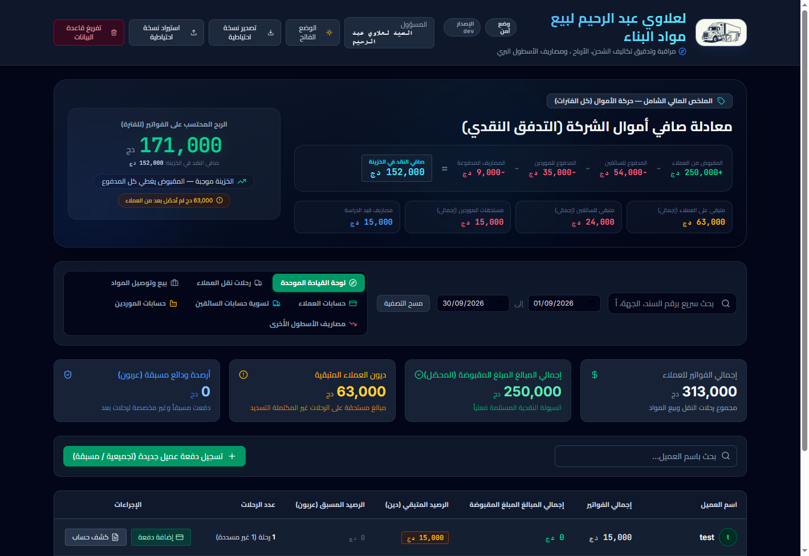

# Logistics & Distribution Management Dashboard

An offline-first desktop dashboard for **لعلاوي عبد الرحيم لبيع مواد البناء** — a building-materials
company that runs client transport trips, buys goods from factories and resells them delivered.
The whole interface is Arabic (RTL), and every figure on screen is driven by one money-flow model:
what really entered the till, what really left it, and what is still pending on either side.



## What it does

- **Cash-flow headline** — the master deck computes the company's net cash live:
  received from clients − paid to drivers − paid to suppliers − paid expenses,
  with the invoice-based (accrual) profit kept alongside it. The two figures are also
  mirrored on the executive overview so no screen can disagree.
- **Transport trips** — the truck hire is the client's whole invoiced price; the driver's wage
  is paid out of it and the company margin is derived automatically.
- **Material resales** — buy from a factory, deliver and resell: goods margin plus the
  client-paid transport margin, with the printable facture built from the same shared math.
- **Client / driver / supplier ledgers** — FIFO payment allocation with automatic sweeps:
  an advance recorded before the work settles that work the moment it exists. Driver advances
  and factory prepayments deduct from profit only until the work or goods earn them back.
- **Printable documents** — trip receipts and per-party account statements (filtered by period),
  letterheaded with the company logo on every printed page.
- **Operational safety** — one-file JSON backup/export/import (old backups are restated on
  import), a typed-confirmation database reset, and a read-only ledger self-audit endpoint
  (`GET /api/health/ledger-audit`) that reconciles every cached figure against its allocations.
- Light/dark theme, month/search filtering, and sequential document numbering throughout.

## Architecture

| Layer | Stack |
|---|---|
| Desktop shell | Electron — the Express server runs in a `utilityProcess` child so heavy SQL can never block input |
| Frontend | React 19 + Vite + Tailwind, Recharts |
| API | Express + better-sqlite3 (synchronous, WAL), rerun-safe SQL migrations |
| Shared math | `server/trip-math.ts` / `server/resale-math.ts` imported by both server and UI, so the app can never quote a different figure from the invoice |

The database lives in the OS user-data directory (`logistics.v2.db`); the server picks a free
port automatically if the preferred one is taken.

## Development

```bash
npm install
npm run dev:server   # API on :3001 (tsx watch)
npm run dev          # UI on :3000 (Vite)
```

`npm run lint` type-checks the whole project.

## Building the Windows installer

```bash
npm run release:win
```

This builds the renderer and server, packages a signed NSIS installer into `release/`
with a build-stamped file name, and prints the SHA-256 to ship alongside it.
See [docs/BUILD_AND_SIGN.md](docs/BUILD_AND_SIGN.md) for certificate setup.
